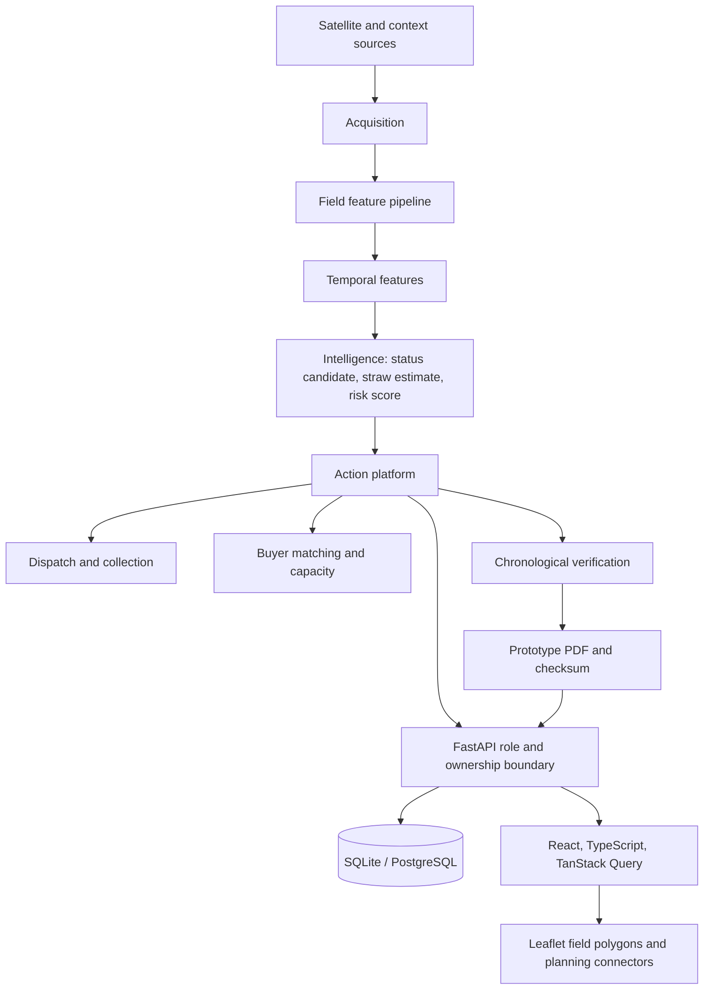

# Architecture

The Block 1–3 acquisition and intelligence components remain the service boundary for the product. The Block 4 read model combines persisted entities with the existing intelligence and eligibility functions. Dispatch, verification, collection, buyer reservations and certificates still use existing backend domain services and database transactions. The frontend does not submit its own risk or straw calculations. The application API is protected by short-lived JWTs and row ownership scopes; `/api/v1/public/certificates/{id}` exposes only the public checksum status and prototype metadata.

`DEMO_MODE=false` is an isolation policy, not an assertion that real sources are connected. Until a live source and registry are verified, status reports `LIVE DATA UNAVAILABLE` and operational writes fail closed.
